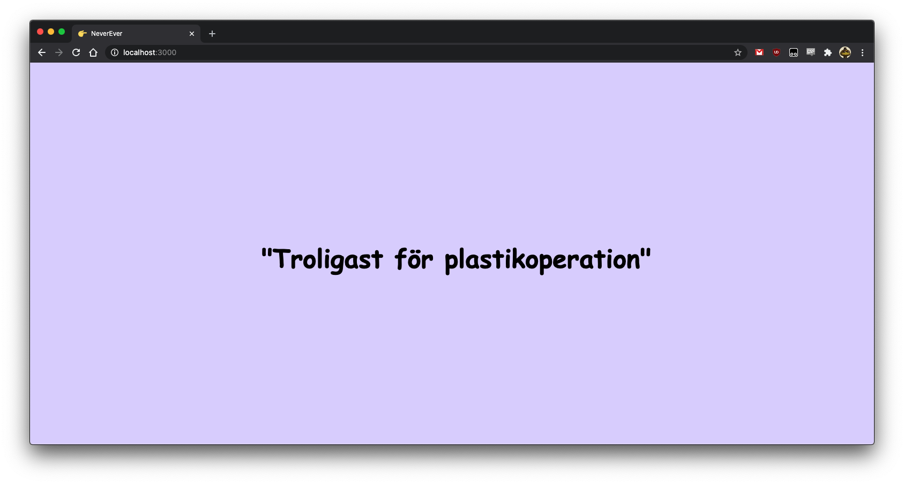

# NeverEver 👉



## Background
Small afternoon project, after being frustrated with the low quality of questions in the free apps built for the Swedish drinking game "Pekleken" I decided to build my own web version. For simplicity's sake the application uses Google sheets as the backend so that the admin can simply share a link and let people add their own questions. 

Since the app only displays a set of phrases either sequentially or randomly it can probably support various games and use cases other then the intended one. Make it your own! 

The application is a little crappy and very hastily made, the goal was to finish it in a single afternoon

## Config parameters

Provide a `config.json` in a repository 

 Property   | Required | Description                                                                        | Default    |
|------------|----------|------------------------------------------------------------------------------------|------------|
| sheetId    | yes      | Google Sheets ID to grab data from                                                 | -          |
| sheetRange | no       | Column or specific range to grab data from. Default value grabs col A from Sheet 1 | Sheet1!A:A |
| port       | no       | Port to run application on                                                         | 3000       |
| random     | no       | Randomise the rows in column                                                       | true       |


## Example config

```
{
  "sheetId": "TmV2ZXIgRXZlciBFeGFtcGxl",
  "sheetrange": "Sheet1!A:A"
  "port": 1234,
  "shuffle": false
}
```

## Installation Guide

1. Clone the repo and run `npm install`

2. Visit the node.js Sheets API quickstart [here](https://developers.google.com/sheets/api/quickstart/nodejs)

3. Press the `Enable the Google Sheets API` button, name the application and select `Desktop app`. Copy the provided `credentials.json` to the root of the project

4. Create a `config.json` file and configure it to your liking

5. Run `npm start`, and visit the website. The program will output a link for you to visit. Grab the authentication token and paste that token back into the terminal and press enter. Reloading the NeverEver app should, the application should work now. This step needs only to be performed once, it generates a `token.json` file in your project

6. After reloading the tab with the application it should run smoothly